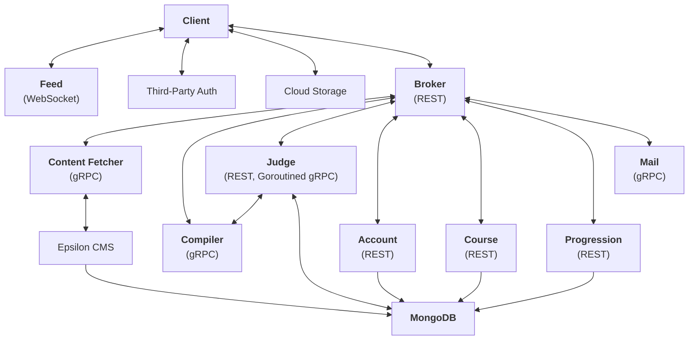

# codemore.io v0.1.0 (ARCHIVED)

This monorepo contains version 0.1.0 of **codemore.io**, which was my first attempt at building a cloud-native microservices architecture that in theory is scalable and maintainable. This monorepo is **DISCONTINUED DUE TO ABUNDANT INCOMPLIANCES WITH IMPORTANT DEVOPS PRINCIPLES AND BEST PRACTICES**. Moving forward, I will attempt to build **codemore.io** for the second time, taking into account the lessons I have learned from building this monorepo. 

The repositories for <b>codemore.io v0.2.0</b> can be found at <b><a href="https://github.com/YanSystems">@YanSystems</a></b>

<!-- <h3 align="center"> Live App 🚀 | Demo 📹 | Documentation 🔍 | Source 📦 </h3> -->

## The old version 0.1.0 architecture

In codemore.io v0.1.0, All client requests are sent to the `broker` service (which serves as an API gateway) with a JSON payload. The `broker` service will then redirect this request via `gRPC` to the correct microservice. The following `mermaid` visualizer depicts the architecture:

